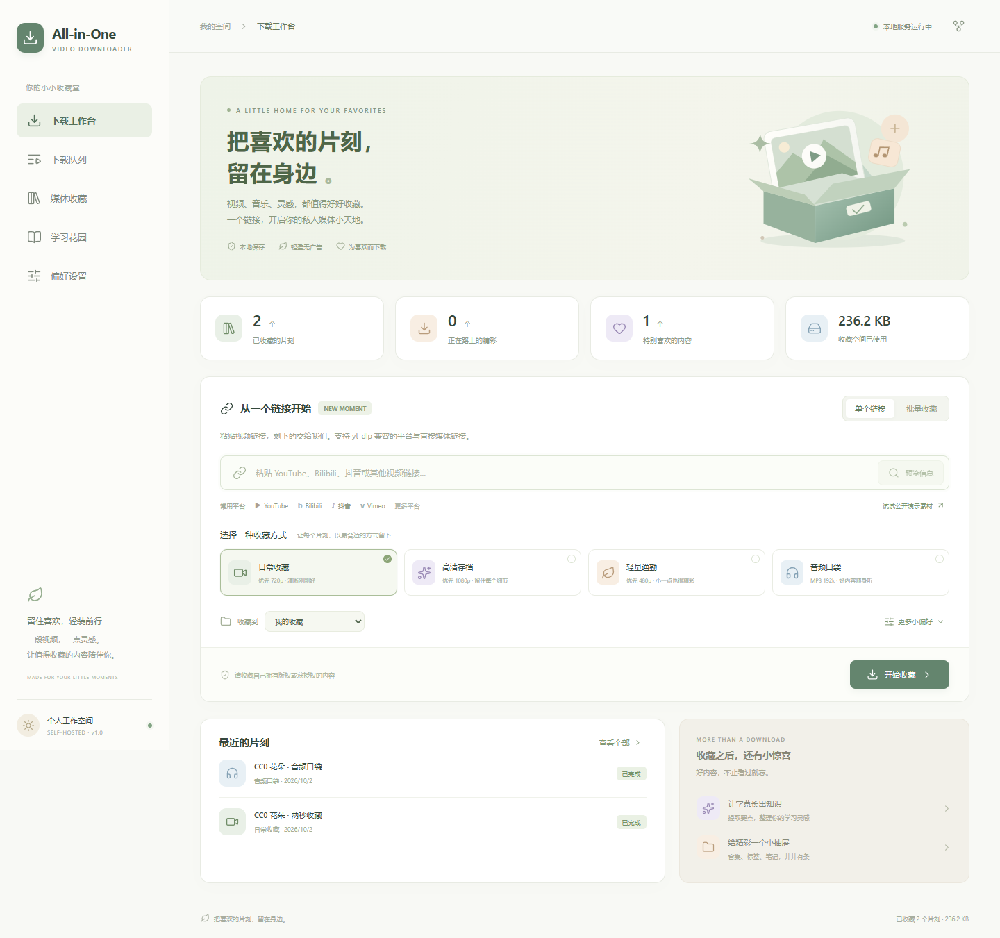

# All-in-One Video Downloader

**把喜欢的片刻，留在身边。** 一个柔和、轻盈的自托管视频工作台，把下载、整理、播放和字幕学习放进同一个小天地。

Vue 3 + TypeScript · FastAPI + SQLite · yt-dlp + FFmpeg · 三服务 Docker Compose



界面实拍：[媒体收藏](docs/screenshots/library.png) · [学习花园](docs/screenshots/learning.png) · [偏好设置](docs/screenshots/settings.png) · [移动端](docs/screenshots/mobile.png)。截图中的两条内容是本机实际下载的 CC0 演示片段；新部署仍从空库开始。

## 先设计，再实现

第 1 条 Git 提交包含完整[项目方案](docs/DESIGN.md)与[课程学习 / 小众项目调研](docs/RESEARCH.md)，随后按功能逐步实现。最终交付包含 **20 条有实际文件变化的提交**。

参考两节编程导航课程，以及 Elengrab、Audiovault、ytdl-gui 的产品思路；独立实现，不复制参考项目源码。项目名称以用户最终确认的 **All-in-One Video Downloader** 为准。

## 可以做些什么

| 场景 | 功能 |
| --- | --- |
| 从一个链接开始 | 元信息预览、多平台解析、多行批量导入、重复链接检测 |
| 按自己的节奏收藏 | 日常 720p、高清 1080p、轻量 480p、MP3 音频四种预设 |
| 让精彩慢慢抵达 | 预约、限速、实时 SSE 进度、暂停 / 尝试续传、取消、失败重试 |
| 留住灵感片段 | 下载后用 FFmpeg 精确剪辑，支持视频和音频 |
| 给精彩一个抽屉 | 自建合集、星标、标签、笔记、搜索、浏览器播放、保存到设备 |
| 让字幕长出知识 | 下载来源字幕、导入 SRT/VTT/TXT、本地提取原句要点、可选 DeepSeek AI 摘要 |
| 带走你的收获 | Markdown 资料卡、JSON、TXT 字幕导出 |
| 留在自己的设备 | SQLite WAL 队列、重启恢复、持久化媒体卷、容量上限、服务状态 |

“全能”指多平台与多工作流，实际站点支持以当前 yt-dlp、网络、地区和授权状态为准。MP4/MP3 等浏览器常见格式可播放；个别来源返回的编码可能需要保存后用本地播放器打开。无字幕视频可以手动导入，首版不做语音转写。未设置 AI 密钥时使用标明来源的本地原句提取。

## 一条命令启动

安装 Docker Desktop（Linux 容器）或 Docker Engine + Compose：

```bash
git clone https://github.com/cjm1020/all-in-one-video-downloader.git
cd all-in-one-video-downloader
docker compose up --build -d
```

打开 **[http://localhost:8090](http://localhost:8090)**。页面提供 MDN CC0 视频演示链接；默认数据库从空状态开始。

```bash
docker compose ps                     # 三个服务的健康状态
docker compose logs -f worker         # 下载日志
docker compose down                  # 停止，保留收藏
```

Docker Hub 在部分网络无法访问时，可在本地 `.env` 指定公开镜像源；参见[部署说明](docs/DEPLOYMENT.md)。没有必要改项目源码。

## 配置和开发

复制 `.env.example` 到 `.env` 可配置端口、访问口令、Cookie 和 DeepSeek；无需密钥即可下载公开内容并整理字幕。默认绑定 `127.0.0.1`，适合个人使用。公开访问请设置访问口令并通过 HTTPS 反向代理部署。

完整步骤、备份恢复、问题排查：[部署说明](docs/DEPLOYMENT.md)。接口：[API 文档](docs/API.md)。验证证据：[测试报告](docs/VERIFICATION.md)。

```bash
# 后端：Python 3.11+
python -m venv .venv
# Windows: .venv\Scripts\activate；Linux/macOS: source .venv/bin/activate
python -m pip install -r backend/requirements-dev.txt
cd backend
python -m uvicorn app.main:app --host 127.0.0.1 --port 8000
# 另一个终端，在 backend 目录启动 Worker
python -m app.worker

# 前端：Node 22.12+（建议 Node 24）
cd ../frontend
npm ci
npm run dev
```

开发时前端代理默认指向 `127.0.0.1:8000`；若端口被其他程序占用，调整 `vite.config.ts` 并同步后端启动端口。

```bash
cd backend
python -m pytest -q
python -m ruff check app tests
cd ../frontend
npm run build
npm run test:e2e                      # 需要正在运行的 Docker 服务与浏览器
```

首次运行浏览器测试可在 `frontend` 执行 `npx playwright install chromium`；Windows 也可设置 `PLAYWRIGHT_EXECUTABLE_PATH` 指向已安装的 Edge/Chrome。完整 Docker 启动和浏览器检查已接入 GitHub Actions。

仅下载自己拥有版权、已获授权或公开授权的素材，不支持绕过 DRM。AI 模式会将选中视频的字幕发送给 DeepSeek。本项目适合单机、可信单用户部署，SQLite 单 Worker 架构不面向大规模公共下载服务。

MIT · [LICENSE](LICENSE)
