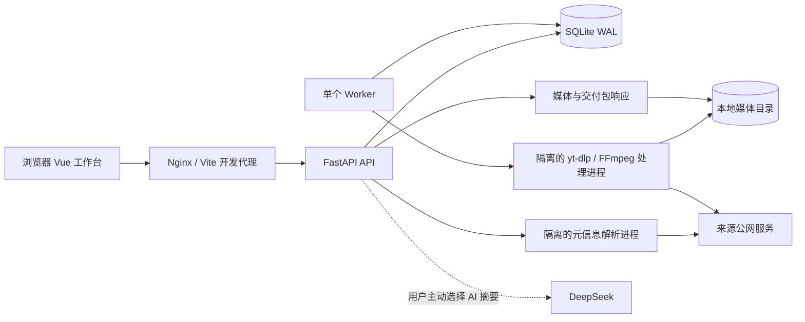

# 架构与边界

系统服务一个可信用户的本机素材工作流。Vue 页面负责输入与状态展示；FastAPI 接受受约束的业务请求；SQLite 保存任务及业务资料；单个 Worker 执行耗时媒体处理。架构经验应通过边界、并发故障和验证证据展示，不能从技术栈数量推定作者工作年限。

## 责任与数据契约

| 边界 | 实现入口 | 应保持的约束 |
| --- | --- | --- |
| HTTP 与访问口令 | `backend/app/main.py` | 认证、同源限制、正文大小检查、错误反馈；不把客户端输入直接当成下载参数 |
| 公网解析与访问 | `backend/app/security.py`、`extractor.py` | 拒绝本机/私网/保留地址、非 HTTP(S)、凭据和非标准端口；解析/下载进程在连接时再次检查地址 |
| 持久队列 | `backend/app/db.py`、`worker.py` | 写事务领取任务，状态更新附带旧状态条件；API 不等待整个下载结束 |
| 媒体文件 | `backend/app/library.py`、`download.py` | 内部文件路径不直接序列化给浏览器；文件服务检查路径与任务状态 |
| 字幕与知识 | `backend/app/learning.py`、`captions.py`、`knowledge.py`、`knowledge_db.py` | 标明来源；字幕改变后处理派生卡片的失效；本地提取不声称是模型生成 |
| 项目工作流 | `backend/app/studio`、`frontend/src/views/StudioView.vue` | 项目资料、素材成员、授权记录、就绪检查和交付包各有明确责任；预算不等于交易 |

Studio 与知识的最新路由及模型以 [API](API.md) 为准。数据库与媒体在同一持久卷，缓存和导出不应成为用户资料的唯一副本。

## 队列状态与并发设计

核心路径为 `queued → downloading → processing → completed`，异常退出进入 `failed`。API 允许特定旧状态下暂停、取消、恢复或重试，并通过条件更新拒绝已经变化的状态。暂停或取消后的处理子进程由 Worker 结束；立即恢复时，尚未释放的活跃租约可返回 409，避免旧进程和新任务并发写同一个素材。

`BEGIN IMMEDIATE` 将「查询待执行任务」和「修改领取状态」纳入同一写事务。Worker 周期更新租约及心跳，重启时将过期执行状态恢复为待执行。该机制支持单 Worker 的故障恢复；它不是多主一致性、任务幂等性的全面证明，也没有为分布式 Worker 设计 fencing token。

实际保护边界：元信息解析最多两个并发，50 秒超时；Worker 单任务执行最多 90 分钟；空间检查覆盖任务开始和运行期间。SSE 大约每 1.5 秒发送任务快照或心跳，适合小规模本地库，任务数量增加时快照大小与 SQLite 扫描成本会增长。

## 业务不变量

- 删除或变更素材后，项目清单应重新检查当前素材与文件，而非沿用曾经可交付的布尔值。
- 授权核对是人工输入的记录。就绪门禁可以阻止缺项，不能识别伪造授权证据。
- 交付文件与清单必须来自同一组项目成员；输出包中的成员名由程序生成，不采用客户端路径。
- 字幕、标记、卡片和提纲可追溯到任务；字幕更新不能让旧派生内容看起来仍来自当前字幕。
- 用户预算以整数分保存，避免金额运算使用二进制浮点；分析面板标为预算，不能标为收入。

这些不变量的测试证据见 [EVALUATION](EVALUATION.md) 与 [VERIFICATION](VERIFICATION.md)。

字幕替换在同一写事务中更新原文、时间轴索引、摘要失效和自动卡片来源哈希。自动卡片的来源哈希与新原文不同时清理；用户手写卡片不依赖自动来源，保留不变。剪辑后的时间轴按片段起点重定位，媒体完成状态与字幕索引一起写入，避免完成标记与旧字幕混用。

## 数据演进与恢复

现有初始化使用 `CREATE TABLE IF NOT EXISTS` 创建表和索引；这是可重复执行的初始化，不是完整的版本化迁移体系。新增表需验证空库和已有任务库均可启动，外键引用正确；修改列类型或删除字段前，需要单独引入版本号、迁移事务和回滚/恢复演练。

备份须同时覆盖 SQLite 及媒体文件。运行中的 WAL 数据库不能靠随意复制主数据库文件保证一致性；采用 SQLite backup API 或按 [DEPLOYMENT](DEPLOYMENT.md) 的停机备份步骤。恢复验收应抽取一条实际媒体、字幕、授权记录和项目成员，确认文件响应与交付清单一致。

## 上线到其他规模前的决策

| 触发条件 | 需要的改造 | 验收证据 |
| --- | --- | --- |
| 一个实例服务多用户 | 身份、项目所有权、角色与对象级鉴权、隔离的存储命名空间 | 跨用户读取/修改/交付拒绝测试 |
| 多个 Worker 或跨主机执行 | 带 fencing 的领取协议、任务幂等性、集中队列、共享文件一致性 | 并发领取、重复执行、失联恢复与租约过期故障注入 |
| 大型素材库 | 分页、数据库级查询、SSE 增量、索引与查询计划 | 有明确数据规模和硬件的延迟/内存测量 |
| 大量 ZIP 交付 | 交付作业、容量与并发限制、缓存生命周期和取消清理 | 大文件、断开连接、磁盘耗尽和孤儿文件清理测试 |
| 对外提供公共下载 | 限流、配额、滥用处理、出站访问政策、来源许可评估 | 外部访问审计及负载测量；当前不承诺具备该能力 |

新增服务必须由测量或真实用户需求触发。单机阶段优先让现有状态机、文件边界和授权缺项可以被复现与评审。
