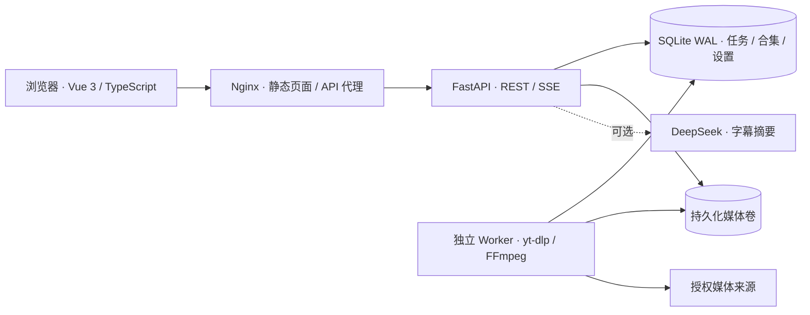

# All-in-One Video Downloader · 项目方案

本方案在任何功能实现之前提交。目标：一个可通过 Docker 自托管、柔和美观、能真实下载和整理授权视频的个人工具。

## 用户流程与范围

粘贴链接（单条预解析 / 多行批量）→ 选择预设、合集、可选剪辑与预约时间 → 持久化队列 → Worker 下载/合并/转码 → 浏览器播放或保存 → 写笔记、整理字幕和学习摘要。

首版实现：多平台元信息解析；批量入队与去重；720p/1080p/480p/MP3 预设；下载进度 SSE；暂停、恢复、取消、重试；定时下载与速率限制；FFmpeg 片段；字幕附带下载与导入；本地摘要与可选 DeepSeek 摘要；视频/音频媒体库；合集、标签、星标、笔记；Markdown/JSON 导出；健康与存储仪表；持久化设置；三服务 Docker Compose；自动化测试及部署文档。

边界：不绕过 DRM；不提供付费内容解锁；首版不做注册、支付、自动频道订阅及无字幕语音转写。平台要求登录时通过只读挂载的 Netscape cookies 文件配置，Cookie 和 API 密钥不进仓库。下载测试使用公开授权演示素材；站点受网络影响的情况如实记录。

## 架构

SQLite WAL + 事务领取保证单机多进程 API / Worker 一致性；首版单 Worker 串行下载。队列先持久化再执行，Worker 心跳与过期租约用于重启恢复；不能把长下载放进 API 请求生命周期。SSE 传送数据库快照，浏览器重连后恢复状态。

Docker 服务：`web`（Nginx，只公开本机 8090）；`api`（FastAPI，内部 8000）；`worker`（同一个后端镜像，单独进程）。共享 `data` 卷，包括 SQLite 和 `media/`。API/Worker 使用非 root 用户，健康检查、重启策略、日志轮转，Nginx 禁止代理缓存 SSE，限制请求体大小。

## 数据及接口

- `tasks`：UUID、URL、预设、标题、平台、状态、进度、预约时间、租约/心跳、文件相对路径、大小、错误、合集、星标、标签、笔记、字幕、摘要、剪辑起止、速率限制、创建/更新时间。
- `collections`：UUID、名称、配色；默认“我的收藏”。
- `settings`：默认预设、速率上限、存储软限额。环境变量仅管理基础设施和密钥。
- `GET /api/health`、`GET /api/status`、`GET/PUT /api/settings`。
- `POST /api/inspect`、`GET/POST /api/tasks`、`POST /api/tasks/{id}/actions/{action}`。
- `GET/PATCH/DELETE /api/tasks/{id}`、`GET /api/tasks/{id}/file`、`GET /api/tasks/{id}/export`。
- `GET/POST/DELETE /api/collections`、`POST /api/tasks/{id}/transcript`、`POST /api/tasks/{id}/summary`、`GET /api/events`。

状态：`queued → downloading → processing → completed`；`paused/cancelled/failed` 可通过明确操作回到 `queued`。用户暂停时终止下载子进程但保留 `.part`；恢复由 yt-dlp 根据来源能力续传。取消保留临时文件供重试，删除任务才清理其目录。预约任务仅到期后领取。

安全：只接收 HTTP(S) 公网链接，拒绝私网/回环/元数据地址、用户信息及危险协议；下载过程的请求与重定向也检查。使用 subprocess 参数数组，禁止用户输入任意 yt-dlp/FFmpeg 选项。下载路径仅在任务 UUID 目录内，文件读取做路径约束。设置可选访问口令、同源请求限制和请求长度限制。默认本机开放；公开部署必须设置口令并配 HTTPS。首版适用于可信单用户、单机部署。

## 页面与视觉

左侧导航 + 右侧工作区：下载工作台 / 下载队列 / 媒体收藏 / 学习花园 / 偏好设置。奶油白背景、鼠尾草绿主色、淡紫与杏色辅助色；宽留白、细边框、圆角卡片、柔和阴影。首页用自绘矢量“收藏盒”插画，不依赖远程图片。清晰展示真实状态，不用虚构下载记录或统计。

## 验证与验收

后端测试：URL/重定向保护、任务状态与去重、预约领取、租约恢复、路径安全、摘要、持久化。前端：TypeScript 检查与正式构建；浏览器端到端检查核心操作、移动端溢出、错误态。部署：实际 `docker compose up --build -d`，三容器健康、公开素材下载、文件回传、音频/剪辑、字幕、持久化重启。最终记录测试结果、截图、已知限制并推送 GitHub。

## 20 条真实提交计划

1. 课程调研及项目设计（本提交）
2. 工程骨架与配置
3. SQLite 持久化队列
4. 安全链接解析
5. 下载 Worker 和预设
6. 任务 API 与队列操作
7. 合集与媒体库
8. 字幕与摘要
9. 设置与健康监控
10. 柔和视觉和导航
11. 下载工作台
12. 实时队列界面
13. 媒体库与播放器
14. 学习花园
15. 偏好设置界面
16. Docker 服务和 Nginx
17. 后端回归测试
18. 响应式与交互完善
19. CI、脚本与部署文档
20. 端到端验证、最终修正、截图与使用说明

每条提交必须有对应文件变化，不生成空提交，不倒填日期、不改写远程历史。
